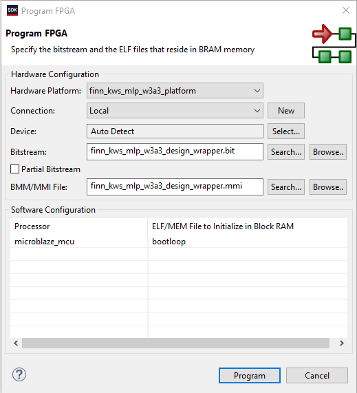
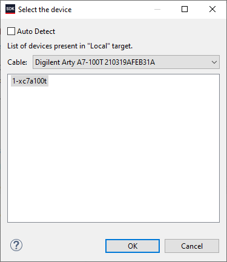
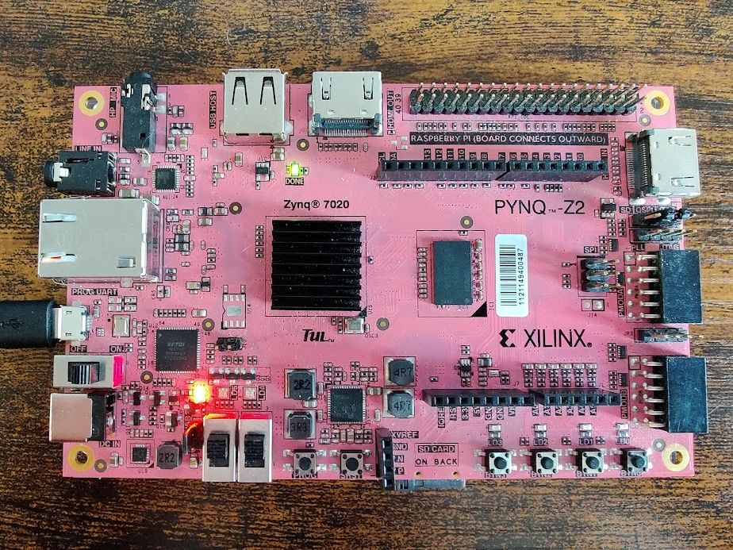
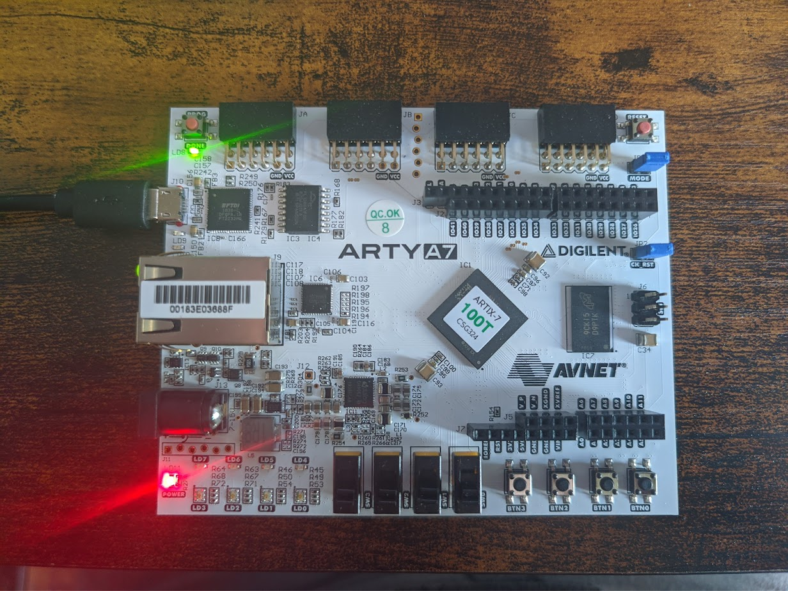
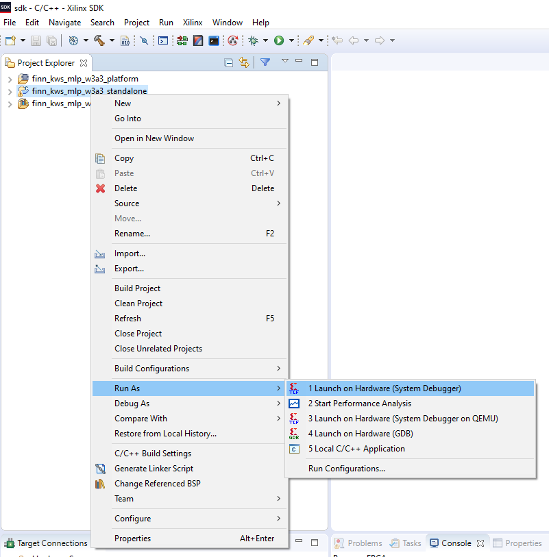
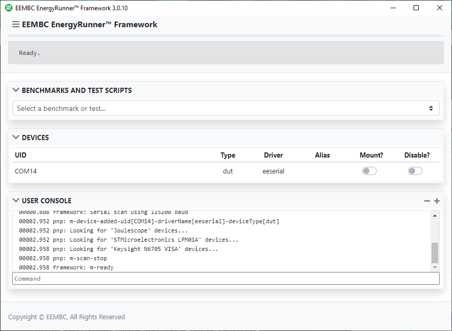

# Anomaly detection with HLS4ML


## Training
Instructions on how to train and export the AD09 model can be found in [training/README.md](training/README.md).
Here also additional instructions for the bin file generation can be found.

## Convert and Synthesize
```bash
cd inference
python convert.py -c <model_config>.yml
```
- To build for the Pynq-Z2, use the `ad09_pynq.yml` config file.
- To build for the Arty A7-100T, use the `ad08_arty_<accuracy|power>.yml` config file, choosing `accuracy` if you want to run accuracy/latency benchmarks, or `power` if you want to run energy benchmarks
  
## Firmware and Test Harness compliation
If you're building over SSH, make sure X11 Forwarding is enabled, or you're otherwise able to see the Xilinx SDK window somehow. 

### Pynq-Z2
In the `inference/pynq-z2` folder
```bash
cd vivado_project/sdk
make sdk gui
```

### Arty A7-100T
In the `inference/arty-a7-100t` folder

If building to run **accuracy and/or latency (performance)** benchmarks:
```bash
cd vivado_project_accuracy/sdk
make sdk gui
```
If building to run **energy (power consumption)** benchmarks:
```bash
cd vivado_project_power/sdk
make sdk gui
```

After running the command, the Xilinx SDK appliation window should open

## Programming the board

If you're intending to run **energy (power consumption)** benchmarks, please refer to the bootloader creation & programming guide below for your relevant board: 

- [Pynq-Z2 Bootloader Creation and Setup Guide](pynq_bootloader.md)
- [Arty A7-100T Bootloader Creation and Setup Guide](arty_bootloader.md)


If intending to run **accuracy and/or latency (performance)** benchmarks:

1. In Xilinx SDK, close any "welome" tab that might be present
2. Plug in your board via USB (making sure you have appropriate dialout/serial permissions if necessary)
3. Press the circled button on the top toolbar (or "Xilinx" -> "Program FPGA" in the toolbar) to open the "Program FPGA" dialog window

	

3. In the dialog window that pops up, press "program" to program the FPGA of the device 

	
	
	1. If you have multiple Xilinx boards attached, or are otherwise experiencing "device not found" type issues, press "Select..." where it's specifying "Device" on this popup, untick "Auto Detect" on the subsiquent popup, selecting your relevant board if need be, then press "OK"

		
		
	
		afterwards, the "Device" field should be your specific board, such as:

		

4. At some point during programming, the green "Done" LED on your board should briefly turn off (if it's not already), then back on, indicating successful programming 
	1. Pynq-Z2

		

	2. Arty A7-100T

		

5. Once the FPGA is programmed, we need to launch the test harness application. Right click on the project ending with `_standalone` in the project explorer, then "Run As" -> "Launch on Hardware (System Debugger)"

	

6.  If the harness has successfully launched, you should see the final lines in the SDK Log being something like:

	```txt
	----------------End of Script----------------

	15:28:43 INFO	: Launch script is exported to file...
	```


	


	and you should be able to see the device in the EEMBC runner application (the UID being whatever its connected via, typically  `COMX` on windows, `/dev/ttyUSBX` on \*nix systems, etc.  ):

	


## Running benchmarks
**Before proceeding, make sure the dataset `.bin`  and `y_labels.csv` files are in the location specified by the runner!**


If you're intending to run **energy (power consumption)** benchmarks, please refer to the connection and setup guide below for your relevant board **before proceeding**:

- [Pynq-Z2 Energy Benchmark Hookup and Setup Guide](pynq_energy_setup.md)
- [Arty A7-100T Energy Benchmark Hookup and Setup Guide](arty_energy_setup.md)

### **accuracy and/or latency (performance)** benchmarks:

#### Pynq-Z2
0. If you haven't already, download and open "EEMBC EnergyRunner Framework x.x.x" ("EEMBC EnergyRunner Framework 3.0.10" at time of this release)
1. Mount the Device by clicking the "Mount?" toggle in the devices list

	

2. Once mounted, Under "Benchmarks and Test Scripts", select "ML Performance x.x.x " ("ML Performance 1.0.1" at the time of this release)
	
3. If running **latency (performance)** benchmarks, enter the number of inferences you to run (official runs require at least 10s of runtime or 10 inferences, the number will vary depending on model/device) in the "Inferene Iterations" of the "Setup" portion. ("Warmup Iterations" can be left at 1)

	

4. Press the "Initalize" to initalize the EEMBC Runner with the appropriate benchmark info, you should see some blue highlighted output in the console and some of the runner's fields populated with info about the current model on the board

	
	

5. If running the **latency (performance)** benchmark, select the "Median Performance" radio button, otherwise if running the **acccuracy**  select the "Accuracy" Radio button, then press "Run" to start the benchmark

	

6. Once completed, the results of the benchmark will be printed out to the console, along with relevant logs (results included) being saved to the `~/eembc/runner/sessions` in a directory named the timestamp of when the benchmark completes


#### Arty A7-100T
0. If you haven't already, download and open "EEMBC EnergyRunner Framework x.x.x" ("EEMBC EnergyRunner Framework 3.0.10" at time of this release)
1. Mount the Device by clicking the "Mount?" toggle in the devices list

	

2. Once mounted, Under "Benchmarks and Test Scripts", select "ML Performance x.x.x " ("ML Performance 1.0.1" at the time of this release)

	

3. If running **latency (performance)** benchmarks, enter the number of inferences you to run (official runs require at least 10s of runtime or 10 inferences, the number will vary depending on model/device) in the "Inferene Iterations" of the "Setup" portion. ("Warmup Iterations" can be left at 1)

	

4. Press the "Initalize" to initalize the EEMBC Runner with the appropriate benchmark info, you should see some blue highlighted output in the console and some of the runner's fields populated with info about the current model on the board

	
	

	4a. **IMPORTANT NOTE!** Due to a initalization/reset issue with the internal timer and the soft microblaze CPU core on the Arty, the test harness **_MUST_** be relaunched via the harness in order to have proper timestamps (and therefor latency results) during the test. This shouldn't impact performance, nor does it impact Energy benchmarks since those are timed via an external source. 
		
5. If running the **latency (performance)** benchmark, select the "Median Performance" radio button, otherwise if running the **accuracy**  select the "Accuracy" Radio button, then press "Run" to start the benchmark

	

6. Once completed, the results of the benchmark will be printed out to the console, along with relevant logs (results included) being saved to the `~/eembc/runner/sessions` in a directory named the timestamp of when the benchmark completes

### **Energy Consumption (Power)** benchmarks:

#### Pynq-Z2
0. If you haven't already, download and open "EEMBC EnergyRunner Framework x.x.x" ("EEMBC EnergyRunner Framework 3.0.10" at time of this release)
1. Make sure you have flashed the FSBL to the Pynq so that it's able to cold boot the accelerator and Test Harness, as described in the [Pynq Bootloader Readme](pynq_bootloader.md)
2. Make sure you've connected all required devices as described in the [Pynq Energy Setup Readme](pynq_energy_setup.md)
1. Mount the iomanager (Arudino Uno) and energy monitor (Joulescope) in the energy runner

	

2. Once mounted, Under "Benchmarks and Test Scripts", select "ML Energy x.x.x " ("ML Performance 1.0.1" at the time of this release)

	
	
3. **_Make sure the power supply voltage is set to 5 Volts!_**, then press initalize to initalize the runner with test info. _**This will take up to 10 seconds!**_ During this time, the Pynq will briefly power on, send a message via the iomanager, then power back off. 

	

5. If initilization is successful, you will see information about the loaded model in the device. Enter the number of inferences you to run (official runs require at least 10 s of runtime or 10 inferences, the number will vary depending on model/device) in the "Inference Iterations" of the "Setup" portion. ("Warmup Iterations" can be left at 1)

	

6. Select the "Median Energy" radio button, then press "Run" to start the benchmark

	

6. Once completed, the results of the benchmark will be printed out to the console, with a plot of energy usage over the duration of the benchmark displayed below the console.  along with relevant logs (results included) being saved to the `~/eembc/runner/sessions` in a directory named the timestamp of when the benchmark completes


#### Arty A7-100T
0. If you haven't already, download and open "EEMBC EnergyRunner Framework x.x.x" ("EEMBC EnergyRunner Framework 3.0.10" at time of this release)
1. Make sure you have flashed the SREC SPI Bootloader to the Arty so that it's able to cold boot the accelerator and Test Harness, as described in the [Arty Bootloader Readme](arty_bootloader.md)
2. Make sure you've connected all required devices as described in the [Arty Energy Setup Readme](arty_energy_setup.md)
1. Mount the iomanager (Arudino Uno) and energy monitor (Joulescope) in the energy runner

	

2. Once mounted, Under "Benchmarks and Test Scripts", select "ML Energy x.x.x " ("ML Performance 1.0.1" at the time of this release)

	
	
3. **_Make sure the power supply voltage is set to 7 Volts!_**, then press initalize to initalize the runner with test info. _**This will take up to 25 seconds!**_ During this time, the Arty will briefly power on, send a message via the iomanager, then power back off. 

	

5. If initilization is successful, you will see information about the loaded model in the device. Enter the number of inferences you to run (official runs require at least 10s of runtime or 10 inferences, the number will vary depending on model/device) in the "Inferene Iterations" of the "Setup" portion. ("Warmup Iterations" can be left at 1)

	

6. Select the "Median Energy" radio button, then press "Run" to start the benchmark

	

6. Once completed, the results of the benchmark will be printed out to the console, with a plot of energy usage over the duration of the benchmark displayed below the console.  along with relevant logs (results included) being saved to the `~/eembc/runner/sessions` in a directory named the timestamp of when the benchmark completes
